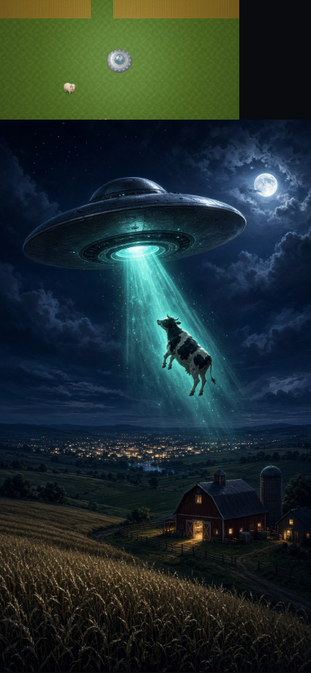

# Saucer Raid

**[Play the game →](https://menearz.github.io/saucer-raid/)**

Night raid over a painted valley. Pick a craft, abduct livestock and townsfolk, blast glowing specialty homes for lasers and cloaks. Heat draws jeeps, then tanks, helis, and jets. Survive the clock to upgrade and hit the next sector.

[](https://menearz.github.io/saucer-raid/)

## Controls

| Input | Action |
| --- | --- |
| WASD / left stick | Fly. A is left, D is right. |
| Hold **Beam** | Tractor beam — lifts cows, pigs, people, even a jeep |
| Hold **Fire** / click | Laser. Mouse aims on desktop. |
| P | Pause |

Works portrait and landscape. The phone buzzes on Android.

## Campaign

- Hangar: Classic Disc, Yoke Runner, Chrome Spike, Long Ember, Pale Keel, Twin Wake
- Minimap: amber = guns, pale = cloaks, red = army
- Survive the timer → upgrade bay → next sector (harder army)
- Salvage buys engines, tractor, armor, shields, cannons

## Engine

- **WebGL** via three.js — instanced terrain, batched sprites, GPU particles
- **Physics** — mass, drag, spatial-hash collisions, explosion impulses, beam springs
- React · Vite · Tailwind v4 · Zustand

## Local / Grok Build CLI

```bash
git clone https://github.com/menearz/saucer-raid.git
cd saucer-raid
npm install
npm run dev
# or: grok
```

## Website vs store wrap

The live game stays on GitHub Pages (`npm run build:pages` → `docs/` with base `/saucer-raid/`).

A separate Capacitor wrap (`npm run build:wrap`, base `/`) is how the same game can later become a Play Store AAB and an iOS app. That wrap is not uploaded yet — it waits on Google ($25) and Apple ($99) developer accounts. See [WRAP.md](WRAP.md).
